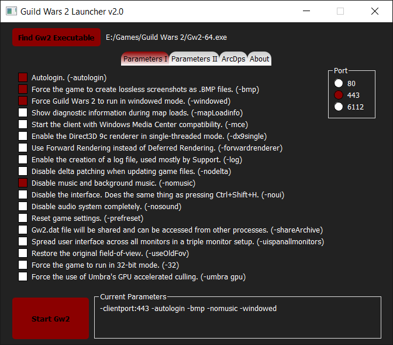

# Guild Wars 2 Launcher

Program to launch [Guild Wars 2](https://www.guildwars2.com) with different parameters.

## Download
+ [Latest Release](https://github.com/ddc/Gw2Launcher/releases/latest)

## Program Notes
+ Guild Wars 2 "32bits" not supported
+ Configuration, logs and database files will be saved inside "%APPDATA%/Gw2Launcher"
+ I did not write ArcDps loader nor do i provide any support for it or it's compatibility with Guild Wars 2. Credit goes to /u/deltaconnected.
+ This program was compiled with PyInstaller

## Acknowledgements
+ [QT5](https://www.qt.io)
+ [Python3.6+](https://www.python.org/downloads)
+ [Guild Wars 2](https://www.guildwars2.com)
+ [ArcDps](http://www.deltaconnected.com/arcdps)
+ [PyInstaller](https://pyinstaller.readthedocs.io/en/stable/installation.html)

## License
Released under the [GNU GPL v3](LICENSE).

## Buy Me a Cup of Coffee
This program is open source and always will be, even if I don't get donations. That said, I know there are people out there that may still want to donate just to show their appreciation so this is for you guys. Thanks in advance!

